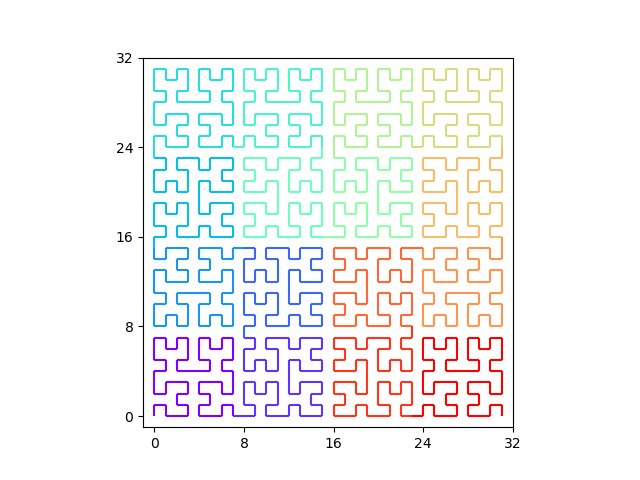

# parallel-computing-sfcurves

## Инструкция по установке и запуску 

Инициализация виртуального окружения Python, установка зависимостей:

```bash
python3 -m venv venv 
source ./venv/bin/activate 
pip install -r requirements.txt
```

Запуск: 
```bash
python3 main.py <N> <N_p>
```
где `N` - размер стороны квадрата, `N_p` - количество процессоров. 

## TODO 
- [x] Кривые Гилберта на плоскости для случая 2^n 
- [x] Простое разбиение на N_p процессоров 
- [x] Визуализация, экспорт в .csv 
- [ ] Обработка случаев N != 2^n (кривые Пеано)
- [ ] Трёхмерная кривая на сфере 
- [ ] Разбиение на сфере
- [ ] Обработка сетки со сгущением 
- [ ] Обработка узлов с неодинаковым весом

### Пример результата разбиения для N = 32, N_p = 16
